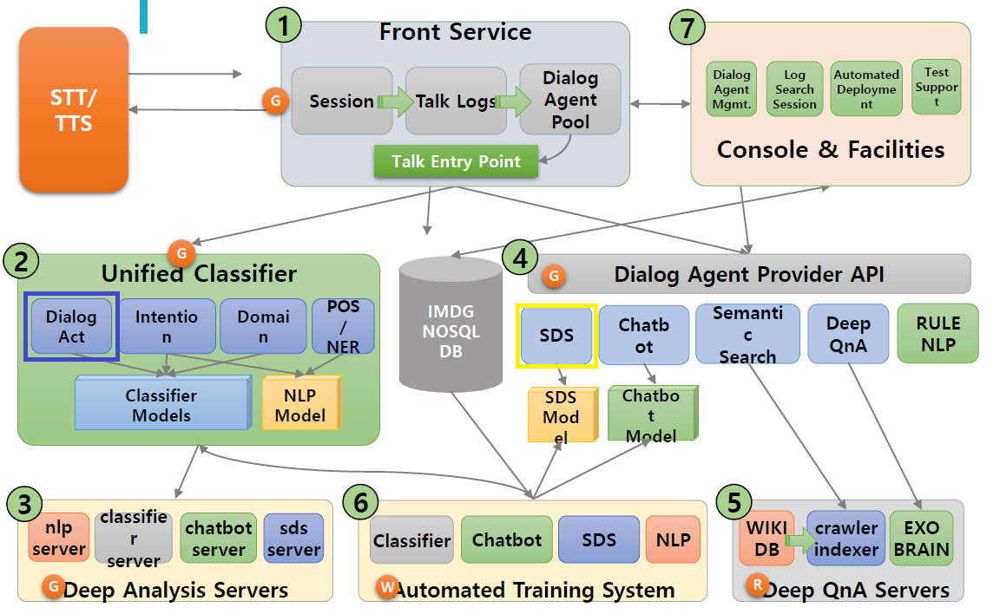

## 챗봇을 위한 뉴스 크롤러(news craweler fo chat bot)

### 요약

MindsLab이란 회사에서 챗봇 제작 교육을 받고있고 플랫폼을 이용한 SDS제작과 코퍼스 입력 및 파이썬 DA(Dialog Act)파일을 제작하여 챗봇을 제작하고있다.
주식, 정치 뿐만 아니라 최근 화제가 되고 있는 가상화폐는 뉴스에 민감하기에 필요성을 느껴 제작하기 시작하였다.
SDS 제작과 코퍼스는 AI - Platform : MAUM에서 진행하고 DA를 작성하도록 하겠다.


### 목적
목적은 크게 세가지이다.
```
1.최신 정보에 민감한 사람을 위한 실시간 크롤링 후 정보수집
2.실시간 키워드를 잡아냄으로 분석데이터 가공
3.파이썬으로 조작하는 DB 자동 저장
```
### version
**master**
```
version 1.0 : MAUM플랫폼에 적용되는 기본 da파일. talk 함수를 수정해야 함
version 2.0 : 아래 함수들을 적용시킴 (예정)
version 3.0 : DB연동하여 자동 저장 및 주기적 실행 (예정)
```
**html 분석 후 본문 수집**
```
crawler v1.0  crawler.py  	<<< 네이버 뉴스 페이지의 구조 파악 후 본문 크롤링
crawler v1.1  crawler_a.py 	<<< 특정 tag(여기선 a)의 text와 url 크롤링
```
**크롤링 후 **
```
crawler v2.0  keyword_and_cral.py	<<<1. 특정 분야의 네이버 뉴스의 URL들을 크롤링
					<<<2. URL을 방문하며 기사 본문 크롤링
					<<<3. 모아 놓은 기사들의 키워드 추출
```

**원하는 검색어로 크롤링하기 **
```
search v1.0  search.py		<<<한글을 URL인코딩을 하여 주소창에 입력			
```

